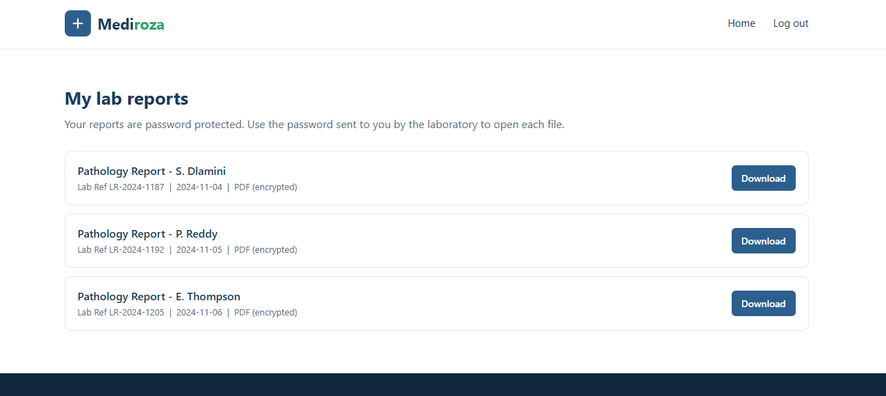

# NETWORKWALKS – Week 4
## Black-Box Penetration Testing – Mediroza Hospital

### 📌 Project Overview

This project was completed as part of my **4-week Cybersecurity Internship at NETWORKWALKS**.

Week 4 focused on a **black-box penetration testing capstone project** against a simulated hospital environment, **Mediroza Hospital**.

The objective was to perform reconnaissance, identify vulnerabilities, exploit them within the authorized lab environment, assess their impact, and document the findings with remediation recommendations.

---

## 🎯 Objectives

- Perform reconnaissance and enumeration
- Identify the application's attack surface
- Discover hidden paths and exposed resources
- Identify sensitive data exposure
- Test web application vulnerabilities
- Exploit identified vulnerabilities in the authorized environment
- Perform password/hash analysis
- Assess security impact
- Prepare a professional penetration testing report

---

## 🔍 1. Reconnaissance

The assessment began with reconnaissance and attack-surface mapping.

During the reconnaissance phase, the application was analyzed to identify available resources and potential entry points.

A `robots.txt` file was identified during the assessment, which disclosed hidden paths within the application.

### Key Finding

- Identified `robots.txt`
- Discovered hidden application paths
- Used the disclosed information to continue enumeration

---

## 🔓 2. Sensitive Data Exposure

During enumeration, an **unprotected directory** was discovered.

The directory exposed a database backup containing sensitive information, including:

- Staff salary records
- Shareholder records

### Impact

An exposed database backup can allow unauthorized users to access sensitive organizational information without proper authentication or authorization.

---

## 💥 3. SQL Injection

A **SQL Injection vulnerability** was identified in the patient portal.

The vulnerability was successfully exploited within the simulated environment to **bypass authentication**.

### Impact

The vulnerability demonstrated how improper input handling and insecure database queries can allow an attacker to bypass authentication controls and gain unauthorized access.

### Evidence


---

## 🔑 4. Password Cracking

During the assessment, **3 encrypted patient reports** were retrieved.

The associated hashes were analyzed using the **Networkwalks Password Cracker** and subsequently cracked using **Hashcat** with the **RockYou wordlist**.

### Tools Used

- Networkwalks Password Cracker
- Hashcat
- RockYou wordlist

### Hash Calculator


### Password Cracking – Step 1


### Password Cracking – Step 2


### Impact

This demonstrated the security risks associated with weak passwords and inadequate password protection.

---

## 📄 5. Patient Reports

During the assessment, **3 encrypted patient reports** were successfully retrieved after the relevant security controls were bypassed.

### Evidence



---

## 📝 6. Penetration Testing Report

A professional penetration testing report was prepared after completing the assessment.

The report included:

- Executive Summary
- Scope and Methodology
- Technical Findings
- Vulnerability Details
- Risk Ratings
- Impact Assessment
- Evidence
- Remediation Recommendations

---

## 📊 Key Findings

| # | Vulnerability / Finding | Impact |
|---|-------------------------|--------|
| 1 | Information disclosure through `robots.txt` | Information Disclosure |
| 2 | Unprotected database backup | Sensitive Data Exposure |
| 3 | SQL Injection | Authentication Bypass |
| 4 | Weak Password / Hash Protection | Credential Exposure |

---

## 🛡️ Recommended Remediation

### 1. Secure Database Backups

- Remove database backups from publicly accessible directories
- Store backups outside the web root
- Apply appropriate access controls
- Regularly audit publicly accessible files and directories

### 2. Prevent SQL Injection

- Use parameterized queries
- Implement prepared statements
- Validate and sanitize user input
- Avoid dynamically constructed SQL queries
- Implement secure error handling

### 3. Strengthen Password Security

- Enforce strong password policies
- Use secure password hashing algorithms
- Use unique salts
- Implement authentication rate limiting
- Monitor repeated failed login attempts

### 4. Reduce Information Disclosure

- Review `robots.txt` configuration
- Avoid exposing sensitive or administrative paths
- Regularly review the application's attack surface

---

## 💡 Key Takeaway

My biggest takeaway from this project was that serious security impact does not always come from one dramatic vulnerability.

A combination of small security oversights — such as an exposed backup, an unsanitized input, and weak password protection — can form a chain that leads to significant impact.

This capstone helped me understand how multiple vulnerabilities can be identified, exploited, and connected together during a penetration testing engagement.

---

## 🎓 Internship Details

**Organization:** NETWORKWALKS  
**Internship:** Cybersecurity Internship  
**Duration:** 4 Weeks  
**Project:** Week 4 Black-Box Penetration Testing Capstone  
**Target:** Mediroza Hospital – Simulated Environment  
**Mentor:** Waqas Karim (CCIE)

---

## 🔐 Skills Demonstrated

- Black-Box Penetration Testing
- Reconnaissance
- Enumeration
- Web Application Security
- SQL Injection
- Authentication Testing
- Sensitive Data Exposure
- Password Hash Analysis
- Hash Cracking
- Vulnerability Assessment
- Risk Assessment
- Penetration Testing Reporting

---

## ⚠️ Disclaimer

All testing was performed in an **authorized simulated environment** for cybersecurity training and educational purposes.

No unauthorized systems or real-world targets were tested.

---

## 🙏 Acknowledgement

A huge thank you to **Waqas Karim (CCIE)** and the entire **NETWORKWALKS team** for providing an incredible hands-on learning experience throughout the internship.

I look forward to continuing to learn and grow in the field of cybersecurity. 🚀

---

## 📂 Project Files

This repository contains the documentation and evidence collected during the Week 4 penetration testing capstone.

```text
NETWORKWALKS-B083-WK4/
│
├── README.md
├── hash claculator.png
├── password cracking 1.png
├── password cracking 2.png
├── reports.png
└── sql injection.png
